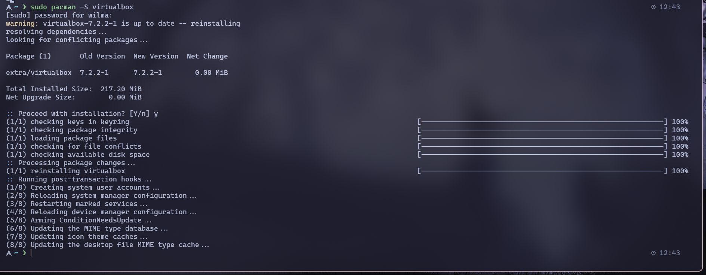
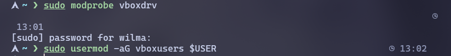
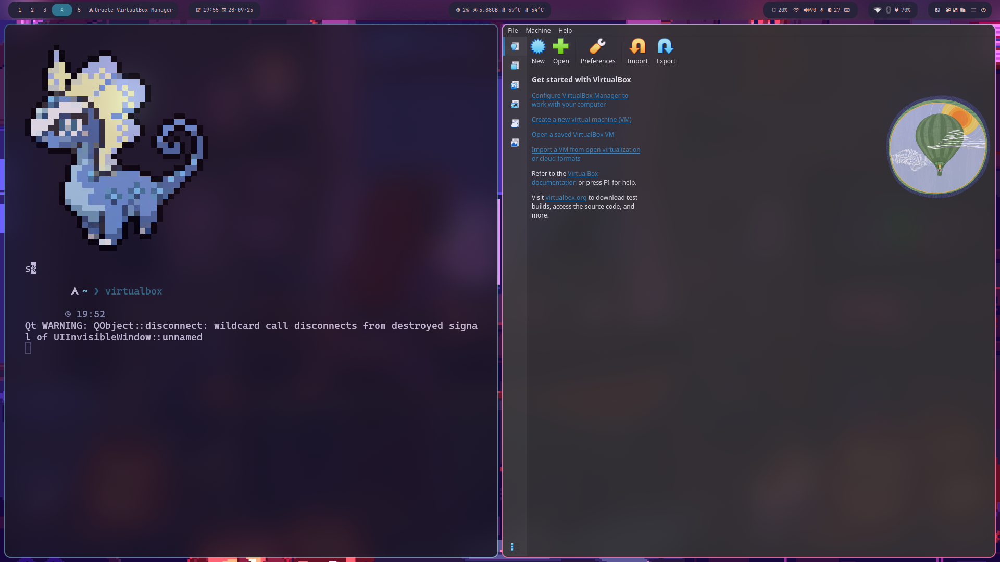
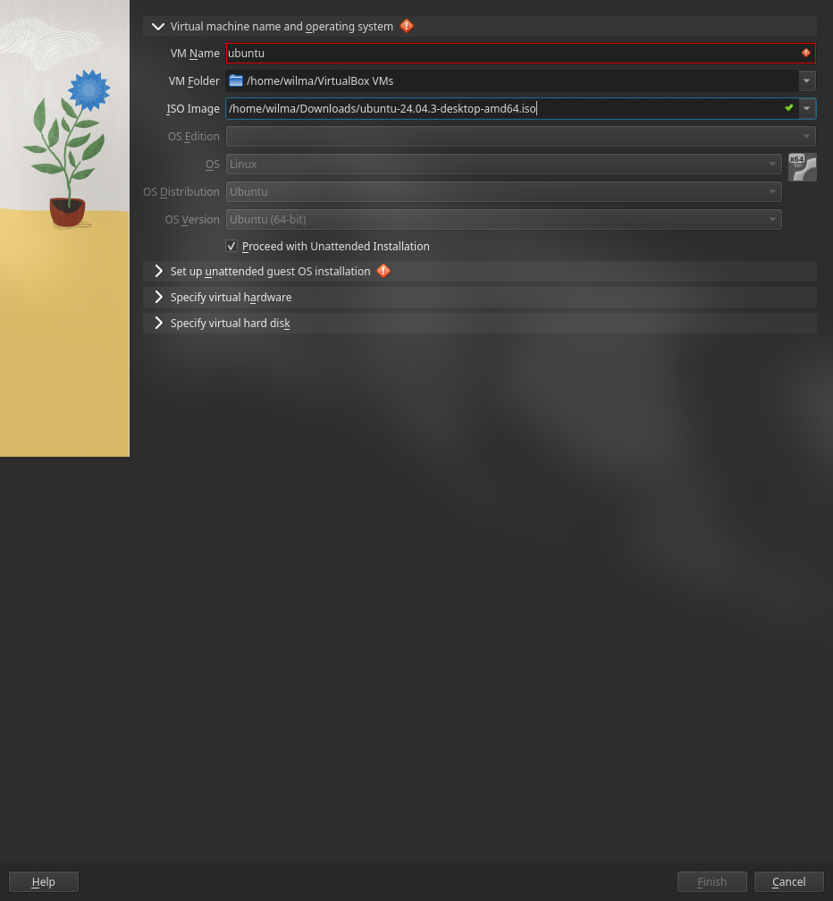
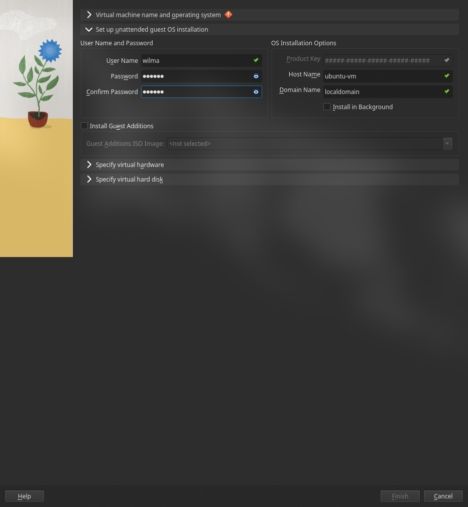
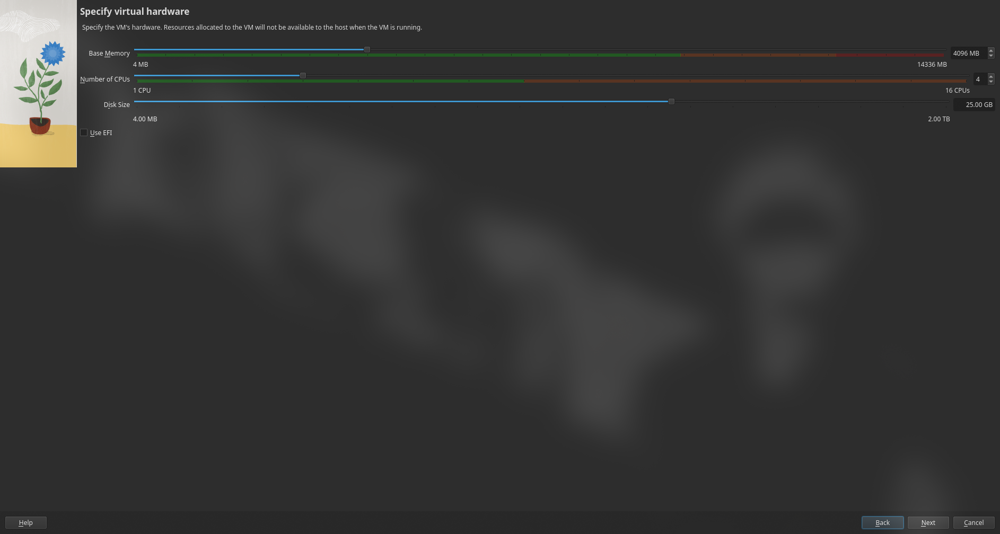
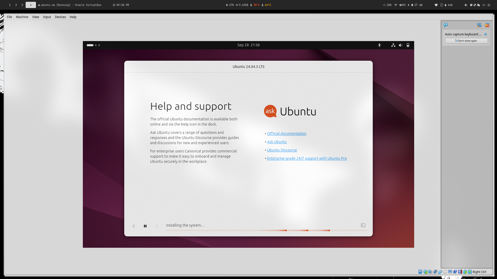
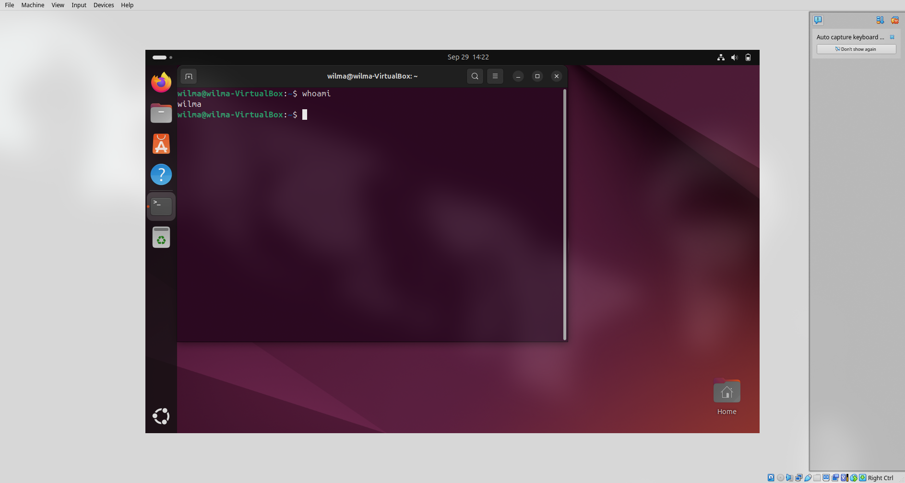

# Panduan Instalasi virtualbox
## Wilma Auraruna Khalif - A11.2024.15841
## _Installasi VM menggunakan Arch linux_

Langkah pertama adalah menggunakan _package manager Arch_ 'pacman' untuk menginstal paket 'virtualbox'

```bash
sudo pacman -S virtualbox
```



## Konfigurasi Kernel dan Hak Akses Pengguna

### Kernel

Kernel adalah suatu media pusat sistem operasi untuk menjebatani antara hardware dan software.

Virtualbox memerlukan kernel aga bisa berinteraksi dengan hardware komputer.

```bash
sudo modprobe vboxdrv
```

**modprobe** adalah perintah linux yang digunakan untuk menambah atau menghapus modul dari kernel Linux.

**vboxdrv** adalah nama modul driver utama virtualbox.

Perintah ini akan memuat driver VirtualBox ke dalam _kernel_ yang sedang berjalan, sehingga virtualbox dapat berfungsi.

### Group
Untuk mengizinkan pengguna biasa menjalankan virtualbox, pengguna harus menjadi anggota dari grup khusus.

```bash
sudo usermod -aG vboxusers $USER
```
* **usermod:** Modifikasi user yang sudah ada. Menambahkan user ke dalam grup sudo agar bisa menjalankan perintah sebagai root.
* **aG:** Artinya (-a) adalah *append* pengguna ke group (-G). 
* **vboxusers:** Nama grup khusus virtualbox.
* **$USER:** Singkatan praktis untuk nama pengguna yang sedang aktif.



## Menjalankan Virtualbox


## Instalasi Ubuntu
Sebelum itu, kita membutuhkan iso ubuntu terlebih dahulu. **Berikut Link untuk mendownload:**

```link
https://ubuntu.com/download/desktop
```
Setelah itu tekan **Ctrl + N** untuk membuat VM yang baru.



* Pilih ISO image yang sudah di download.
* Namai dengan ubuntu

### Set up Unattended guest OS installation

Samakan saja seperti yang di gambar.

### Set Up Hardware Untuk VM
Spesifikasi minimum yang direkomendasikan ubuntu, yaitu 25 Gb storage, RAM 2 GB (disarankan 4 GB atau lebih), dan CPU dual-core 64 bit.


Setelah itu press next lalu finish.

### Install Ubuntu
**Step Terakhir** yaitu melakukan instalasi ubuntu dari ubuntu installer.


---
### Ubuntu VM sudah siap digunakan

---
## Network Configuration
