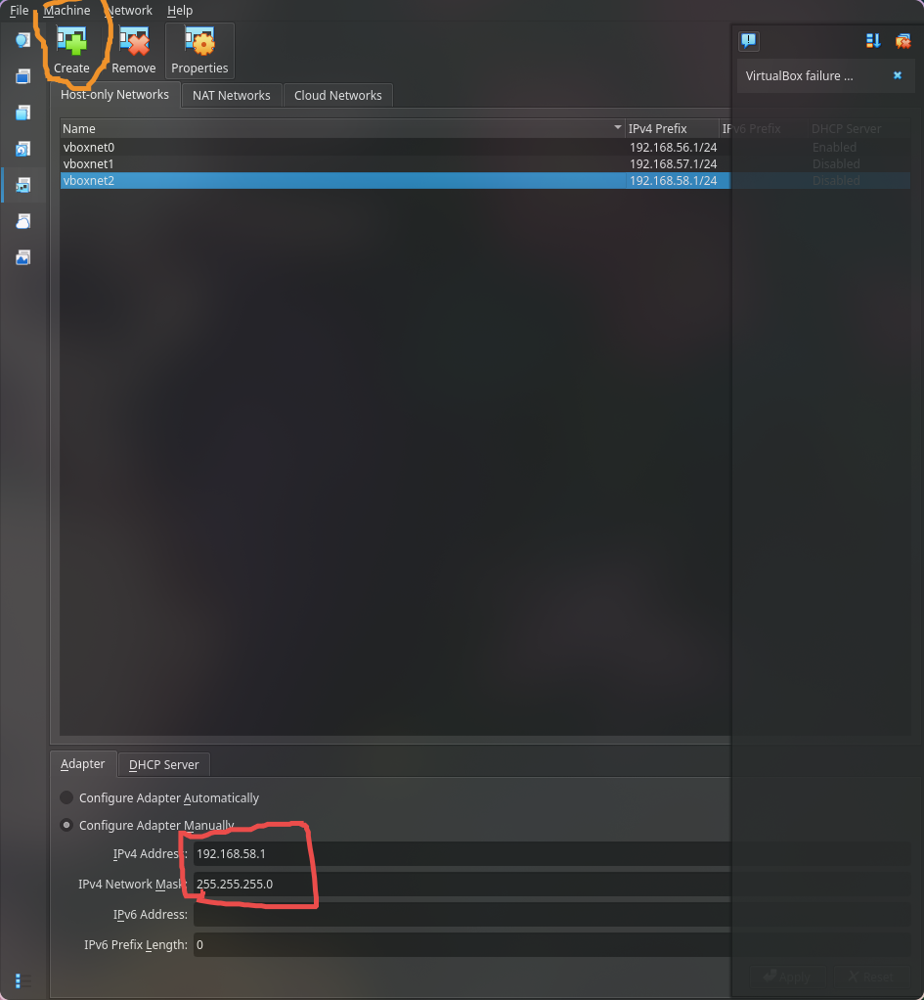

<div align='center'>

# 👇** Panduan Penggunaan Virtual Machine **👇

## **Wilma Auraruna Khalif - A11.2024.15841**

</div>

## ✨ Instalasi VM menggunakan Arch linux

Langkah pertama adalah menggunakan _package manager Arch_ 'pacman' untuk menginstal paket `virtualbox`

```bash
sudo pacman -S virtualbox
```


## ⚙️ Konfigurasi Kernel dan Hak Akses Pengguna

### Kernel

Kernel adalah suatu media pusat sistem operasi untuk menjebatani antara hardware dan software.

Virtualbox memerlukan kernel aga bisa berinteraksi dengan hardware komputer.

```bash
sudo modprobe vboxdrv
```

- **modprobe** adalah perintah linux yang digunakan untuk menambah atau menghapus modul dari kernel Linux.

- **vboxdrv** adalah nama modul driver utama virtualbox.

> [!NOTE]
> Perintah ini akan memuat driver VirtualBox ke dalam _kernel_ yang memerlukan kernel aga bisa berinteraksi dengan hardware komputer.sedang berjalan, sehingga virtualbox dapat berfungsi.

### Group

Untuk mengizinkan pengguna biasa menjalankan virtualbox, pengguna harus menjadi anggota dari grup khusus.

```bash
sudo usermod -aG vboxusers $USER
```

- **usermod:** Modifikasi user yang sudah ada. Menambahkan user ke dalam grup sudo agar bisa menjalankan perintah sebagai root.
- **aG:** Artinya (-a) adalah _append_ pengguna ke group (-G).
- **vboxusers:** Nama grup khusus virtualbox.
- **$USER:** Singkatan praktis untuk nama pengguna yang sedang aktif.


## 🚀 Menjalankan Virtualbox


## 📥 Instalasi Ubuntu

Sebelum itu, kita membutuhkan iso ubuntu terlebih dahulu. **Berikut Link untuk mendownload:**

```link
https://ubuntu.com/download/desktop
```

Setelah itu tekan **`CTRL + N`** untuk membuat VM yang baru.


- Pilih ISO image yang sudah di download.
- Namai dengan ubuntu-vm

### Set up Unattended guest OS installation


Samakan saja seperti yang di gambar.

### Set Up Hardware Untuk VM

Spesifikasi minimum yang direkomendasikan ubuntu, yaitu 25 Gb storage, RAM 2 GB (disarankan 4 GB atau lebih), dan CPU dual-core 64 bit.


Setelah itu press next lalu finish.

### Install Ubuntu

**Step Terakhir** yaitu melakukan instalasi ubuntu dari ubuntu installer.

## 

### Ubuntu VM sudah siap digunakan


## 🌐 Network Configuration

### 🔌 NAT

---

**Nat** adalah cara paling simpel untuk mengakses jaringan eksternal dari _virtual machine_. **Gampangnya** ketika VM meminta akses internet, **host** akan menerjemahkan perintah itu ke router.

### 🔎 Cara check adapter:

1. Click ubuntu lalu shortcut **`CTRL + S`**


2. Pilih Network

> [!NOTE]
> Virtualbox otomatis akan menggunakan NAT sebagai default adapter.


3. Test Ping


### 💥 Bridged Adapter

Konsep Bridged Adapter, yaitu vm dan host di jaringan atau IP yang sama. Analoginya: VM menjadi komputer dengan jaringan yang sama seperti host.

### 🔎︎ Cara Mengganti Adapter Menjadi Bridged

1. Click **`Attached to`**, lalu pilih Bridget Adapter.


2. Ping Bridged


### 🖥️ Host Only Adapter 🖥️

Host only bisa disebut juga dengan komunikasi private antara host (PC Fisik) dengan VM itu sendiri atau VM dengan VM.

### ⚙️ Konfigurasi Host Only Adapter

1. **Konfigurasi IP pada host.**

Menggunakan command line sebagai berikut:

```bash
sudo ip addr add 192.168.58.1/24 dev vboxnet0
```


2. **Konfigurasi IP pada VM.**

Buat dulu virtual network interface pada VM yang berfungsi seperti port atau kabel yang menghubungkan VM dengan host.

- Pilih Network atau bisa dengan shortcut **`CTRL + H`**
  

- Click create lalu config IP address.
  

> [!NOTE]
> Samakan IPv4 Address dengan IP host.
> Contoh cara menyamakan IP:
> | Device | IP Address | Connection |
> | -------- | ------------- | -------------------- |
> | Host | 192.168.58.41 | ✅ Same Network |
> | VM | 192.168.58.42 | ✅ Same Network |
> | Other VM | 192.168.10.41 | ❌ Different network |

- `Attached to` ganti Host Only Network, lalu pada bagian name pilih vboxnet yang sudah dibikin.
  

- Config IP yang ada di OS Ubuntu juga.
  

> [!NOTE]
> Syntax **`dev`** artinya adalah device. Lalu apa itu `enp0s3`
> | Bagian | Artinya |
> | ------ | ------------------------------------- |
> | **en** | Ethernet (koneksi kabel) |
> | **p0** | Jalur utama pada motherboard |
> | **s3** | Slot nomor 3 tempat adapter terpasang |
